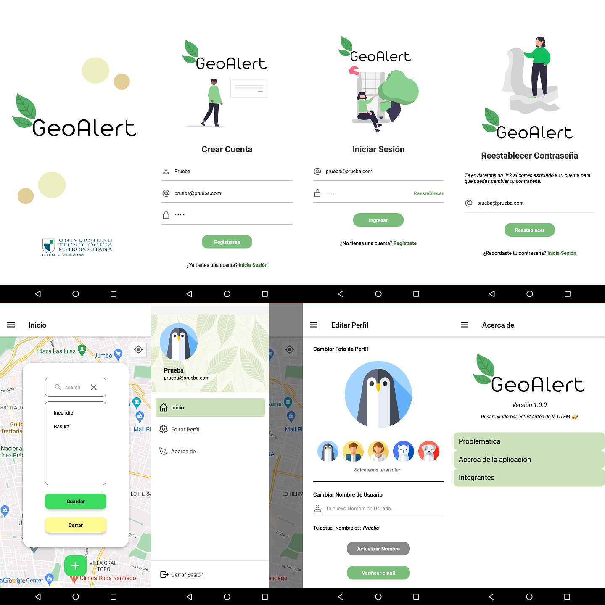

# Proyecto GeoAlert

_Proyecto App Móvil de la asignatura Computación Móvil 2022-2 de la Universidad Tecnológica Metropilitana._

## Información 🚀

Aplicación móvil realizada en React Native con TypeScript que permite al usuario mediante un mapa marcar zonas donde ocurran alertas medioambientales, como incencios menores o basurales.

La aplicación cuenta con:

* Inicio de Sesión mediante Firebase.
* Mapa para marcar las zonas de alertas.
* Configuración del perfil del usuario.

## Instalación 🔧

_Asegurese de tener NodeJS instalado en su ordenador._

Para poder hacer uso de la App, debes tener instaladas todas las dependencias de NodeJS
del proyecto. Para ello, en el directorio del proyecto (./geoApp), mediante la consola de 
comandos del sistema, ejecuta el siguiente comando:

```
npm install
```

## Ejecución 🔩

En la consola de comandos, ejecuta el siguiente comando: 

```
npm expo start
```
Puedes usar la aplicación _Expo Go_ para leer el código QR y así probar la apliccación.

## Uso 📢

Inicia sesión en la aplicación. Si no cuentas con un usuario, puedes registrar uno con tu correo. Si quieres marcar un punto en el mapa donde se encuentre el problema, presiona el botón de 'Geolocalización'. Este te llevará directamente a tu posición actual. Pulsa el botón '+' y selecciona el tipo de problema (Incendio o Basural), luego selecciona en 'Guardar' y las coordenadas estarán almacenadas en la base de datos de la aplicación.

## Integrantes ✒️

* Alexis Abarca Arias
* Francisco Díaz Hernández
* Luis Correa Céspedes
* Rodrigo Aguirre Rodriguez

## Información adicional

**Asignatura**: Computación Móvil 2022-2

*Ingeniería Civil en Computación mención Informática*
*Universidad Tecnológica Metropolitana*

**Disclaimer**: _Los datos obtenidos por la aplicación son con fines educativos y sin ánimos de lucro. La aplicación es solo un proyecto universitario._

## Imágenes

